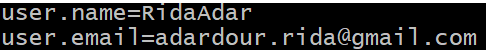
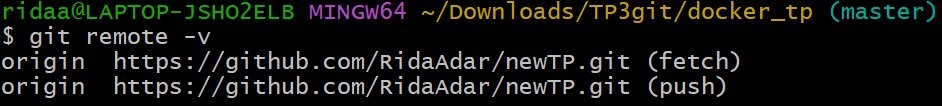
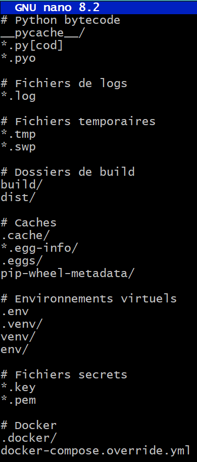
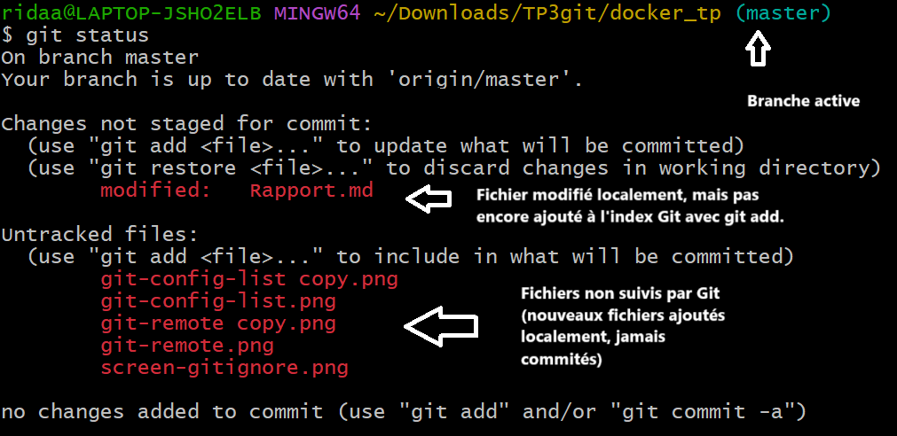

# Rapport

> **Groupe :** 

  - ***Rida ADARDOUR*** 

  - ***Tarek OMARI***

  - ***Pierre Chrislin DORIVAL***

# TP Git & Docker – Rapport
 
### Enoncé :  


Le projet consistait à améliorer l'organisation et la gestion du dépôt existant docker_tp. Après l’avoir cloné et relié à un nouveau dépôt distant, j’ai :

- Configuré un fichier .gitignore adapté,

- Utilisé des branches Git pour le développement,

- Marqué des versions stables avec des tags,

- Employé des commandes avancées comme rebase et cherry-pick,

- Intégré des outils collaboratifs Git,

- Automatisé des processus Docker via GitHub Actions.


## Tâche 1 : Préparation de l'environnement et vérification du dépôt
 
- **1.1. Clonage du dépôt :**
 
Le dépôt GitHub fourni (`docker_tp`) a été cloné en local à l’aide de la commande suivante :
 
```bash
git clone https://github.com/RidaAdar/docker_tp.git
```


* **1.2 Configuration de Git :**
 
Avant toute manipulation, la configuration de l’environnement Git a été vérifiée et ajustée pour s'assurer que les informations de l'utilisateur sont bien définies.
 
```bash
git config --global user.name "VotreNom"
git config --global user.email "votremail@example.com"
```
Puis, la configuration a été vérifiée avec :

```bash
git config --list
```

📸 **Capture d'écran 2 (Affichage de la configuration Git)**  




* **1.3. Initialisation du nouveau dépôt distant**

Après avoir cloné le projet, un nouveau dépôt GitHub a été créé. Le lien distant a été mis à jour comme suit :

```bash
git remote remove origin
git remote add origin https://github.com/<username>/<new-repo>.git
```
📸 **Capture d'écran 3 (Changement de dépôt distant avec `git remote`)**  
👉 

## Tâche 2 : Configuration avancée du fichier `.gitignore`
 
* **2.1 Création et optimisation du fichier `.gitignore` :**
 
Un fichier `.gitignore` a été créé et configuré pour ignorer les fichiers et dossiers inutiles au suivi de version, en particulier ceux liés à Docker et à l’environnement local.
 
> Voici les principales entrées ajoutées :


📸 **Capture d'écran 4 (Édition du fichier .gitignore dans l'éditeur)**  
👉 

* **2.2 Vérification des fichiers ignorés :**
 
La commande suivante a été utilisée pour vérifier que les fichiers définis dans `.gitignore` ne sont plus suivis par Git :
 
```bash
git status
```
📸 **Capture d'écran 5 (`git status` montrant que les fichiers sont ignorés)**  
👉 
 
💬 **Commentaires :**

- ✅ Les fichiers temporaires et d’environnement (`.log`, `.pyc`, `.venv/`, `build/`, etc.) sont bien ignorés grâce au `.gitignore`.
- 🖼️ Les fichiers `.png` sont des **captures d’écran prévues pour le rapport** : ils ne sont pas ignorés et seront commités volontairement.
- 📌 Le statut affiché est donc **normal et maîtrisé**.

 
## Tâche 3 : Mise en place d’un workflow de développement collaboratif
  
* **3.1 Création de branches thématiques :**
 
Pour organiser le développement collaboratif, plusieurs branches ont été créées, chacune associée à une fonctionnalité ou une correction spécifique :
 
- `feature/generate_dashboard`

- `feature/new_graph`

- `bugfix/division-error`
 
La commande utilisée pour créer une branche thématique est :
 
```bash
git checkout -b feature/generate_dashboard
```


📸 **Capture d'écran 6 (Création d'une branche locale avec `git checkout -b`)**  

👉 

 
* **3.2 Développement et commits :**
 
Sur chaque branche, les modifications sont suivies de commits explicites, en utilisant une sémantique standard :
 
```bash
git commit -m "feat: ajout du dashboard interactif"
```
 
**Convention de nommage des messages de commit**
 
- `feat:` → ajout d'une nouvelle fonctionnalité

- `fix:` → correction d’un bug

- `BREAKING CHANGE:` → changement majeur pouvant casser la compatibilité

- `perf:` → amélioration des performances sans changement fonctionnel

📸 **Capture d'écran 7 (Commit structuré sur la branche `feature/new_graph`)**  
👉 

* **3.3 Pull Requests et Revue de code**
 
Une fois le développement terminé, une Pull Request (PR) est créée depuis GitHub pour proposer l’intégration des changements dans la branche `main`.
 
📸 **Capture d'écran 8 (Création d’une Pull Request sur GitHub)**  

👉 
 
Les coéquipiers sont invités à commenter, relire, et approuver les modifications. En cas de conflit, GitHub alerte, et une résolution manuelle peut être nécessaire avant merge.
 
> **Commentaires :**
 
  - Le système de PR permet un contrôle qualité collaboratif avant d’intégrer une fonctionnalité.

  - Chaque branche reste isolée, ce qui évite les effets de bord sur `main`.
 
📸 **Capture d'écran 9 (Discussion et validation d’une Pull Request)**  

👉 

 
## Tâche 4 : Utilisation et gestion des tags Git
 
---
 
* **4.1 Création de tags pour marquer les versions**
 
Une fois une version stable atteinte (après l’intégration d’une fonctionnalité complète ou d’une correction importante), un **tag annoté** est créé pour figer cette version dans l’historique Git :
 
```bash
git tag -a v1.0.0 -m "Version 1.0.0 - Première release stable avec Dockerfile fonctionnel"
```
 
📸 **Capture d'écran 10 (Création d’un tag Git annoté)**  

👉 
 
Puis, le tag est poussé sur le dépôt distant :
 
```bash
git push origin --tags
```
 
📸 **Capture d'écran 11 (Push du tag vers GitHub)**  

👉 

 
* **4.2 Vérification et listing des tags**
 
Tous les tags créés peuvent être listés avec la commande :
 
```bash
git tag -l
```
 
📸 **Capture d'écran 12 (Liste des tags disponibles)**  

👉 
 
> **Commentaires :**
 
  - L'utilisation de tags permet de **marquer des versions stables** du projet.

  - Cela facilite la navigation dans l’historique et permet de **lier une version à un livrable précis** (comme une image Docker).

  - Associé à GitHub Actions, un tag peut déclencher automatiquement un build.

 -----

* **4.3 Récupération et exécution d’une image Docker versionnée (via GHCR)**
 
Une fois l’image poussée sur **GitHub Container Registry (GHCR)**, on peut la récupérer avec :
 
```bash
docker pull ghcr.io/<username>/<repo>:v1.0.0
```
Et l’exécuter en local :
 
```bash
docker run -p 8501:8501 ghcr.io/<username>/<repo>:v1.0.0
```
 📸 **Capture d'écran 13 (Pull et exécution de l’image Docker GHCR)**  

👉 

  **Remarque :**
 
- GHCR facilite le **partage des images Docker versionnées**.

- Couplé à **GitHub Actions**, ce mécanisme permet de **publier automatiquement une image Docker à chaque release** via un tag Git.

 
>  **Tâche 4 complétée** : les tags Git sont créés, poussés et utilisés pour piloter la génération d’images Docker versionnées.
 
## Tâche 5 : Expérimentation avec des commandes Git avancées
 
---
 
* **5.1 Rebase interactif**
 
Sur une branche de fonctionnalité, un rebase interactif a été utilisé pour **réorganiser les commits**, fusionner certains entre eux, et **renommer les messages** si nécessaire :
 
```bash
git rebase -i HEAD~3
```
 
📸 **Capture d'écran 14 (Rebase interactif sur la branche `feature/clean-history`)**  

👉 
 
> **Commentaires :**
 
  - Cela permet d’**améliorer la lisibilité de l’historique Git**.

  - Les commits sont mieux organisés, et les messages plus explicites.

  - Très utile **avant une Pull Request** pour ne pas polluer `main` avec des commits inutiles ou trop fragmentés.


* **5.2 Commande `cherry-pick`**
 
Un commit utile d’une autre branche a été récupéré dans la branche courante grâce à :
 
```bash
git cherry-pick <commit_hash>
```

📸 **Capture d'écran 15 (Cherry-pick d’un correctif depuis une autre branche)**  

👉 
 
> **Cas d’usage :**
 
  - Un bug a été corrigé dans la branche `bugfix/typo`, mais cette correction est aussi nécessaire sur `feature/dashboard`.

  - Plutôt que de refaire le commit, on le **"rejoue"** grâce à `cherry-pick`.

---
 
* **5.3 Commande `git stash`**
 
Pendant le développement, certaines modifications non terminées ont été mises de côté temporairement avec :
 
```bash
git stash
```
Et plus tard réappliquées avec :
 
```bash
git stash pop
```
 
📸 **Capture d'écran 16 (stash et récupération de modifications)**  

👉 

 
* **5.4 Visualisation de l’historique des branches**
 
L’arborescence des commits et des branches a été visualisée avec :
 
```bash
git log --graph --oneline --all
```
 
📸 **Capture d'écran 17 (Historique visuel avec `git log --graph`)**  

👉 
 
 
De plus, l’extension Git Graph de VS Code a été utilisée pour un affichage graphique :
 
📸 **Capture d'écran 18 (Topologie des branches avec Git Graph VS Code)**  

👉 

 
 > **Commentaires :**

  - Ces outils permettent de mieux **comprendre la structure du projet**, surtout avec plusieurs branches actives.

  - Très utiles pour les **revues**, les **merges**, et les **validations**.

 
## Tâche 8 : Documentation et suivi du projet sur GitHub
 
---
 
* **8.1 Utilisation des Issues**
 
Des **issues** ont été créées sur GitHub afin de décomposer les tâches à effectuer et **assigner les responsabilités** à chaque membre de l’équipe.
 
📸 **Capture d'écran 19 (Liste des issues créées sur GitHub)**  

👉 
 
> **Commentaires :**
 
  - Chaque issue représente une tâche spécifique (ex : ajout d’un modèle, correction d’un bug, création du `.gitignore`, etc.).

  - Les issues permettent de **suivre l’état d’avancement** du projet en équipe.

  - Elles servent également à **documenter les bugs** rencontrés ou les améliorations à venir.
 
---
 
* **8.2 Organisation avec le Project Board**
 
Un **Project Board GitHub** (type Kanban) a été mis en place pour organiser le travail collaboratif.
 
📸 **Capture d'écran 20 (Project Board avec colonnes Todo, In Progress, Done)**  

👉 
 
 > **Commentaires :**
 
  - Les issues sont intégrées au tableau via des cartes que l’on déplace au fur et à mesure de leur avancement.

  - Le tableau comporte trois colonnes principales :  

  $\Longrightarrow$ **Todo** : tâches à faire  

  $\Longrightarrow$ **In Progress** : tâches en cours  

  $\Longrightarrow$ **Done** : tâches terminées

- Cela permet une **vision claire de l’avancement global du projet**, même à distance.
 
---
 
> **Tâche 8 complétée :**
 Les outils de suivi GitHub (Issues + Project Board) ont été utilisés efficacement pour structurer le travail d’équipe.

 

 
 